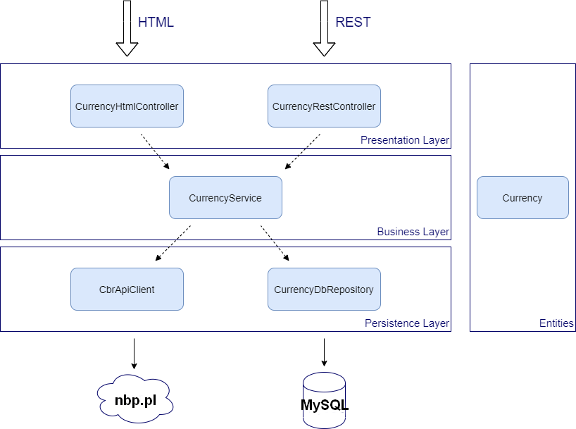

# Test task to get currencies from www.cbr.ru/eng

* The application was implemented using pure PHP without any frameworks
* I added framework Bootstrap to add fancy layout to the page
* In this project I used classic layered architecture (schema is below)
* API REST point to get currencies available under this uri "GET /api"
  * Example: http://localhost/api/currencies?from=2020-01-01&to=2020-04-04&currency=USD
* In order to load date to database, click button called "Click for loading DataBase for the last 30 days" on the home page
* In order to use database locally create environment variables:
  * BST_DB_HOST
  * BST_DB_USER
  * BST_DB_PASSWORD
  * BST_DB_NAME
  
